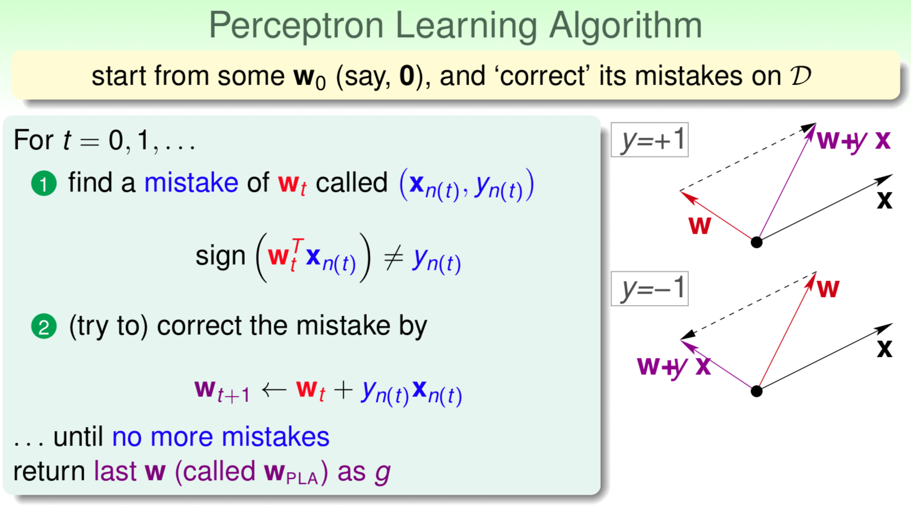
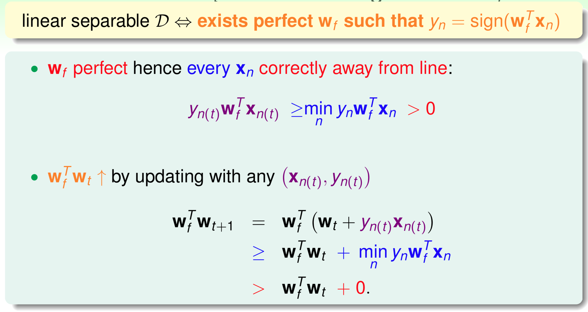
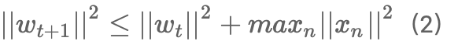
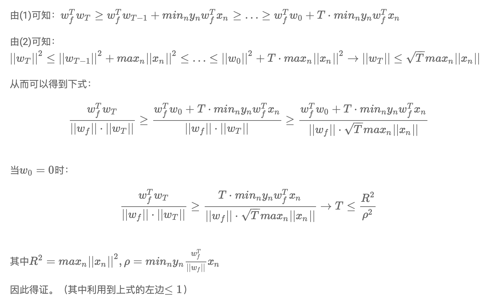

# Chapter 2

**Perceptron Learning Algorithm**

$$w$$ 为分割线的法向量，指向 $$y=1$$ 的方向。

找到的错误的 $$x$$ 和法向量 $$w$$ 的夹角大于90度，因此需要 $$w_{t+1}\leftarrow w_{t}+y_{n}x_{n}$$ 来进行修正。

经过若干次的修正， $$w_{t}$$ 与理想中的 $$w_{f}$$ 越来越接近，夹角越来越小。

**PLA可行性的证明**

1、$$w_{t}$$随着迭代次数 $$t$$ 的增加而逐渐向 $$w_{f}$$ 靠拢

$$min$$ 项可理解为距离 $$w_{f}$$ 最近的 $$x$$ 。

两个向量的内积越来越大还不足以说明二者越来越接近，因为内积增大可能是因为向量的长度增加了，而不是角度变小了，因此还需要证明 $$w_{t}$$ 和 $$w_{t+1}$$ 向量长度的关系。

后续推导需要用到的公式： $$w_{f}^{T}w_{t+1}\geq w_{f}^{T}w_{t}+\underset{n}{min}$$ $$y_{n}w_{f}^{T}x_{n}$$ $$(1)$$

2、 $$w_{t}$$ 的靠拢是逐渐的、有限度的

每次增量不超过 $$max$$ 项，因此二者的长度差别不大。

后续推导需要用到的公式：  

3、证明迭代次数T有限，如果 $$w_{0}=0$$ ，那么经过T次修正后，有

证明如下：

**Pocket Algorithm算法**

找到一个最佳的$$w_{g}$$已被证明是一个NP-hard问题，所以只能找到一个比较好的结果。

Pocket比PLA效率要低，因为每次迭代结束之后都要计算出错的数量。

