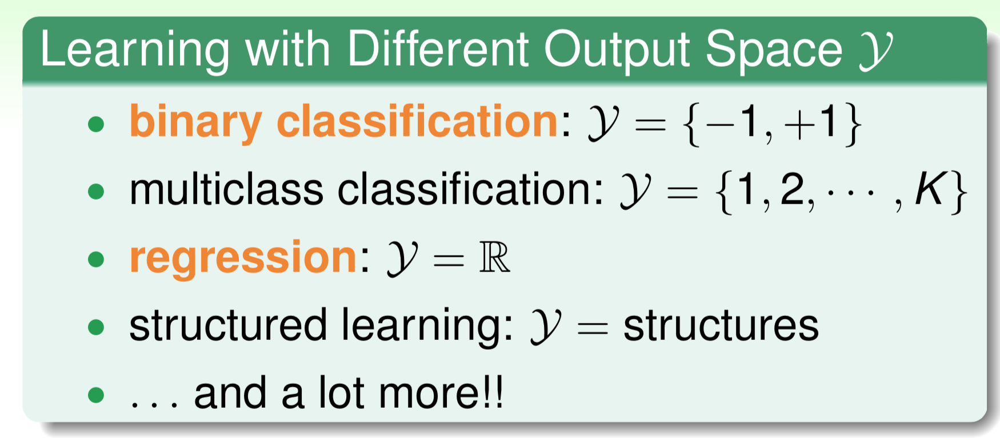
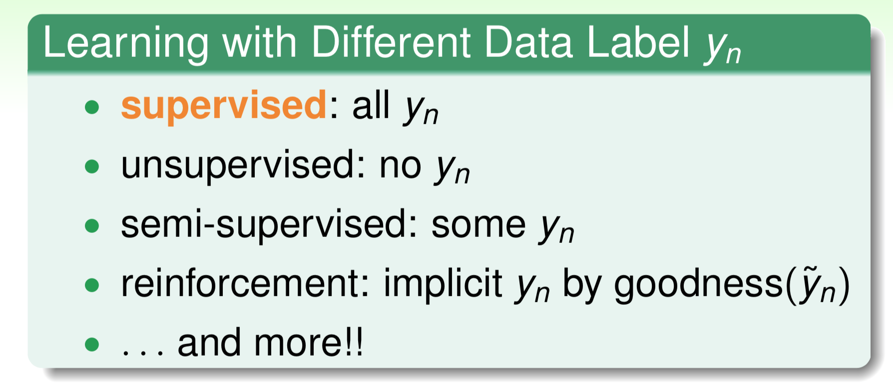
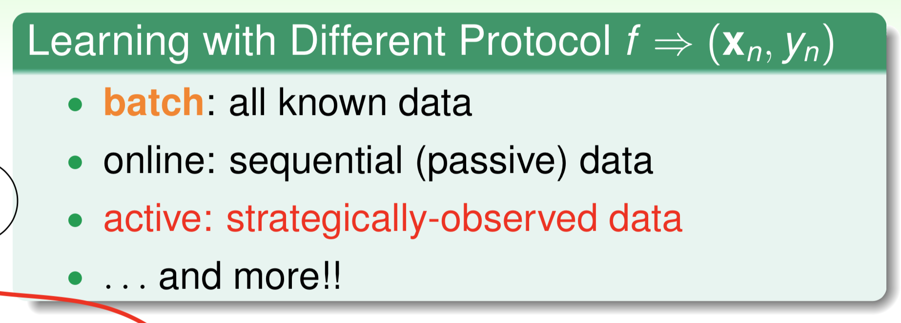
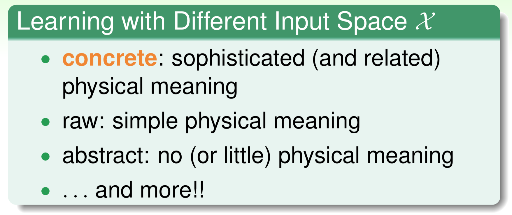

# Chapter 3

1、**Learning with Different Output Space**

**根据输出空间进行分类**

structured learning\(输出是序列/列表/树/etc.\)

**2、Learning with Different Data Label**

**根据数据标签进行划分**

监督/无监督/半监督/强化

强化：对从一个状态转化到一个状态的动作，进行奖励或批评

**3、Learning with Different Protocol**

**根据学习原型进行划分**

batch：数据一次性全部输入

online：输入一部分，进行优化，再进输入一部分，再优化，以此循环

active：机器根据输入的数据，机器挑选部分发出询问

PLA can be easily adapted to online protocol.

Reinforcement learning is often done online.

**4、Learning with Different Input Space**

**根据输入空间进行划分**

输入数据的特征是否明显

大部分机器学习的问题里，三类特征可能都有，关键在于选择哪些特征。

