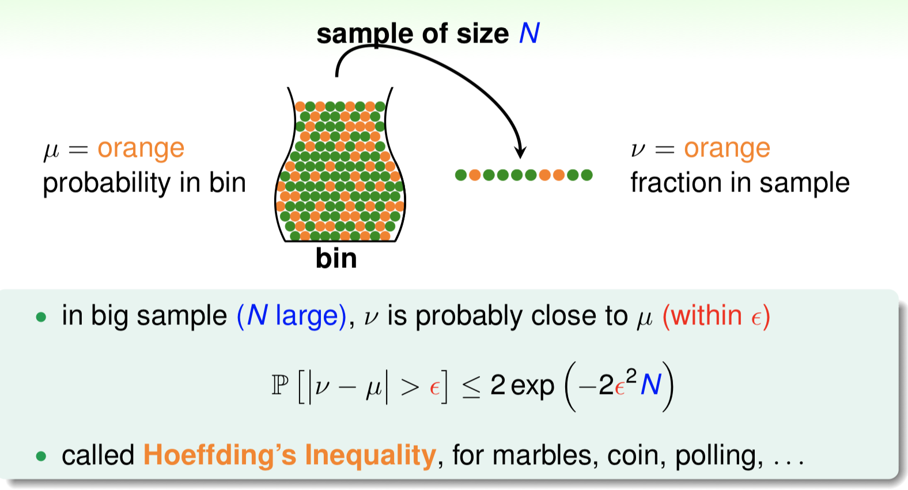
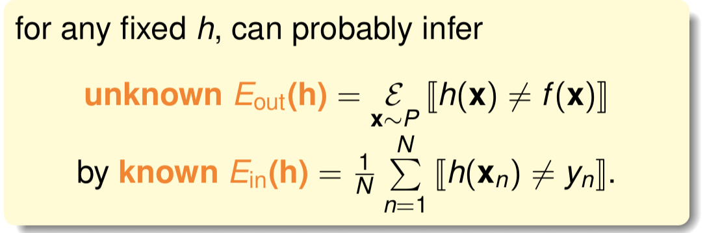
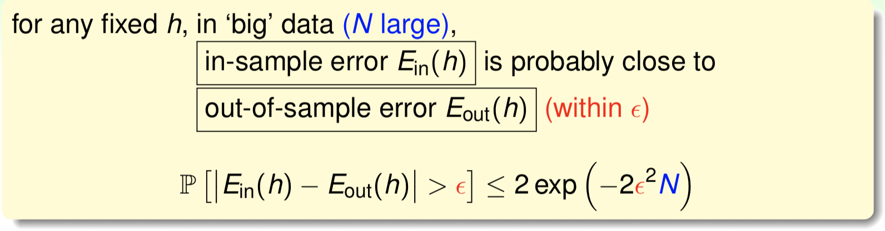
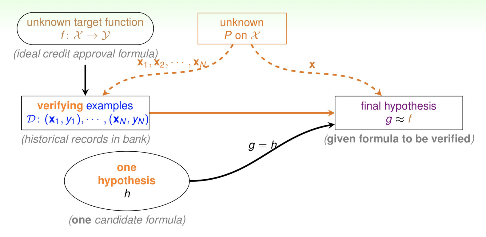
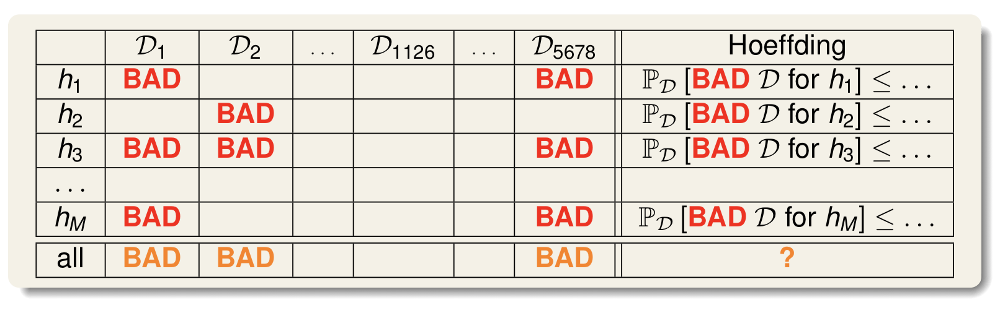
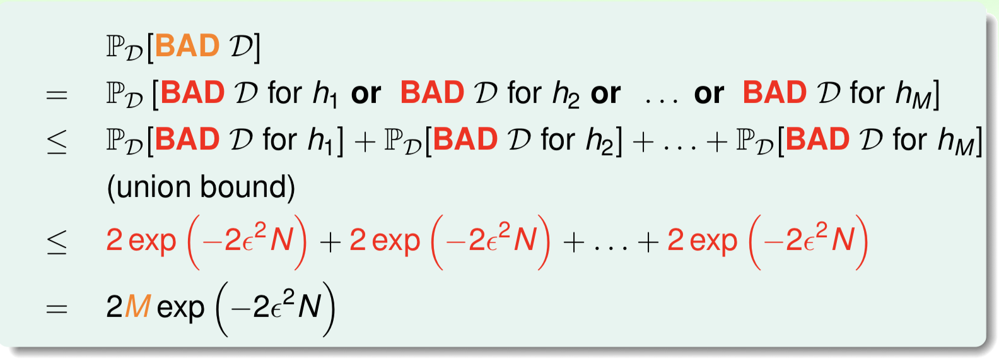
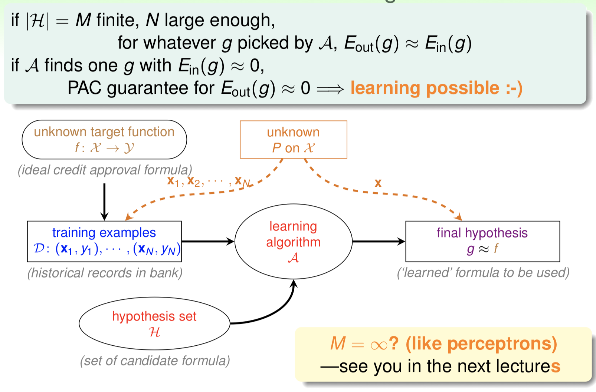

# Chapter 4

**小球容器模型**

样本概率的分布近似于整体分布概率（独立同分布—i.i.d.）

Hoeffding’s Inequality**（**霍夫丁不等式**）**

 ****$$\epsilon$$ 为误差

**联系到Learning**

E为误差

根据sample（in/P）中h与y不相等的概率来推算总体（out）中h与f不相等的概率

这个过程的作用在于验证我们选择的h好不好

学习到的模型的可行的依据是：

① $$E_{in}(h)$$ 是否足够小 ② $$E_{in}(h)\approx E_{out}(h)$$ 是否成立

h为多个hypothesis中的一个，g才是我们需要的模型

**Connection to Real Learning**

**单个假设函数-&gt;多个假设函数**

bad data：使Ein和Eout差距大

抛硬币，记录第i次抛硬币出现的正反面情况。假设我们的抽样中，连续5次硬币出现的都是正面的情况（概率虽然小，但还是有可能发生），那么我们会作出抛出正面的概率是100%的结论。但是我们知道，实际上抛出正面的概率是50%。这种样本，我们称之为bad sample。在机器学习中，我们同样会遇到这种情况，我们把这些不好的数据称之为bad data。机器学习需要在hypothesis set中选择一个最好的h\(x\)，但只要任意的h\(x\)遇上bad data，都有可能对选择带来影响。例如h1本来不是个好的选择，然而因为bad data，恰好导致Ein**\(**h1\)很小，导致A选择了它。

 不同的数据集Dn，对于不同的hypothesis，有可能成为bad data。只要Dn在某个hypothesis上是bad data，那么Dn就是bad data。

根据霍夫丁不等式，bad data的上界可以表示为

M是hypothesis的数量，N是样本D的数量

Ein的大小与M的数量有关，M大，Ein就小，但会导致bad data的概率上升

N大可以保证Ein跟Eout误差小

需要有足够的M保证Ein足够小，但是M大会导致bad data数量增加，导致Ein和Eout差距大。

上述式子表示，当M有限，N足够大时，可以通过演算法A得到一个g，满足上述提到的模型可行的条件。

