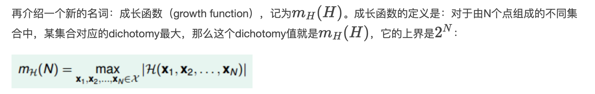

# Chapter 5

**hypothesis的数量M的影响**

把M个hypothesis分成m个dichotomy，hypotheses H是平面上所有直线的集合，个数可能是无限个，但dichotomy H是平面上能将点完全用直线分开的直线种类，上限是2^N个。

通过观察，我们猜测成长函数可能与break point存在某种关系：对于convex sets，没有break point，它的成长函数是2的N次方；对于positive rays，break point k=2，它的成长函数是O\(N\)；对于positive intervals，break point k=3，它的成长函数是O\(N^2\)。则根据这种推论，我们猜测2D perceptrons，它的成长函数mH\(N\)=O\(N^\(k−1\)\)。如果成立，那么就可以用mH代替M，就满足了机器能够学习的条件。

