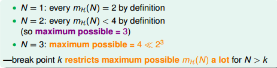
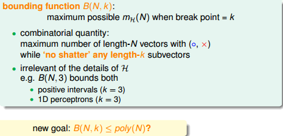
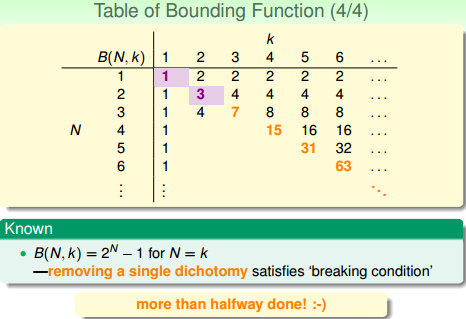
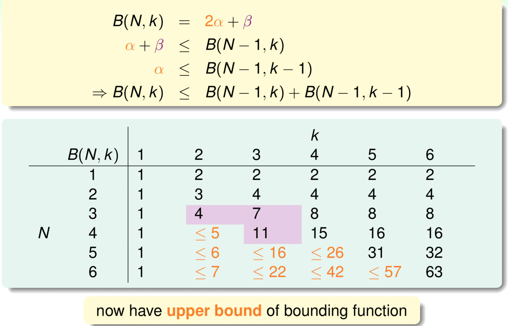
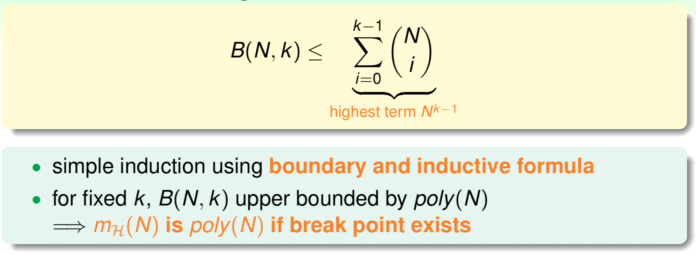
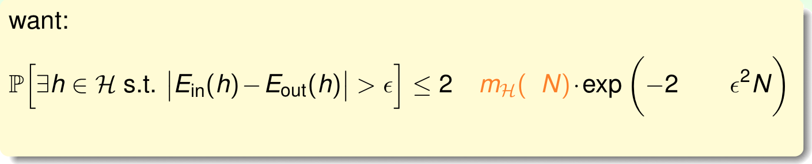
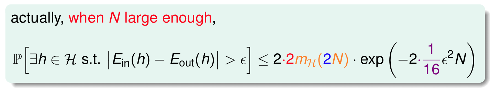
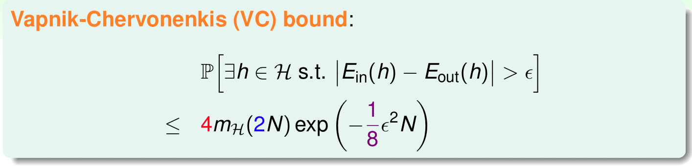

# Chapter 6

当 N &gt; break point k，成长函数的maximum possible value显著下降并远小于 2^N。

#### 边界函数 Bounding Function（成长函数的上限）

  **首先讨论k&gt;=N的情况，比较简单：**

对k=1，给定N个输入，只有一种划分的可能，因为任何第二种划分都会导致前一个划分的点被shatter。

当k&gt;N时，N个输入的全排列都不会被shatter，所以B\(N,k\)=2^N

当k=N时，N个N个输入的全排列都会被shatter，但去掉任何一种情况，就不会被shatter，所以等于2^N-1

**下面讨论k&lt;N的情况：**

以B\(4,3\)为例，首先想着能否构建B\(4,3\)与B\(3,x\)之间的关系。

首先，把B\(4,3\)所有情况写下来，共有11组。也就是说再加一种dichotomy，任意三点都能被shattered，11是极限。

对这11种dichotomy分组，目前分成两组，分别是orange和purple，orange的特点是，x1,x2和x3是一致的，x4不同并成对，例如1和5，2和8等，purple则是单一的，x1,x2,x3都不同，如6,7,9三组。

将Orange去掉x4后去重得到4个不同的vector并成为α，相应的purple为β。那么B\(4,3\)=2α+β，这个是直接转化。紧接着，由定义，B\(4,3\)是不能允许任意三点shatter的，所以由α和β构成的所有三点组合也不能shatter（alpha经过去重），即α+β≤B\(3,3\)。

另一方面，由于α中x4是成对存在的，且α是不能被任意三点shatter的，则能推导出α是不能被任意两点shatter的。这是因为，如果α是能被任意两点shatter，而x4又是成对存在的，那么x1、x2、x3、x4组成的α必然能被三个点shatter。这就违背了条件的设定。这个地方的推导非常巧妙，也解释了为什么会这样分组。此处得到的结论是α≤B\(3,2\)。

由此得出B\(4,3\)与B\(3,x\)的关系为：

最后，推导出一般公式为：

得到边界函数的成长性为O\(N^\(k-1\)\)。

下用数学归纳法证明：

**VC Bound**

成长函数的上界是poly\(N\)的，下一步，如果能将mH\(N\)代替M，代入到Hoffding不等式中，就能得到Eout≈Ein​的结论：

实际上，经过数学的推导（证明略），式子应该为：

最后我们得到了结论，叫做Vapnik-Chervonenkis\(VC\) bound：

对于2D perceptrons它的break point是4，那么成长函数mH\(N\)=O\(N3\)。所以，我们可以说2D perceptrons是可以进行机器学习的，只要找到hypothesis能让Ein≈0，就能保证Ein ≈ Eout。

只要break point存在，那么机器学习就是可行的。

