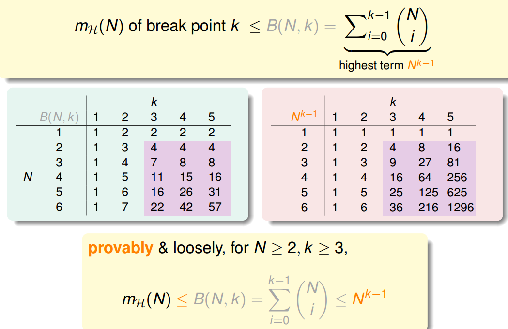

# Chapter 7

机器能够学习必须满足两个条件：

1、假设空间H的Size M是有限的，当N足够大的时候，那么对于假设空间中的任意一个假设g，Ein≈Eout（只要break point存在，则M有上界，一定存在Eout​≈Ein​）

2、利用算法A从假设空间H中挑选出一个g，使得Ein≈0，那么Eout≈0

如果一个假设空间H有break point k，那么它的成长函数是有界的，它的上界称为Bound function。根据数学归纳法，Bound function也是有界的，且上界为N^\(k−1\)。从下面的表格可以看出，N^\(k−1\)比B\(N,k\)松弛很多。

所以我们只要求的上限的上限的上限，即N^\(k−1\)

根据Chapter6的推导，VC Bound可以转换为：

这样不等式只与k和N相关，一般情况下样本N足够大，所以我们只考虑k值。有如下结论：

1、若假设空间H有break point k，且N足够大，则根据VC bound理论，算法有良好的泛化能力

2、在假设空间中选择一个g，使Ein​≈0，则其在全集数据中的错误率会较低

**VC Dimension**

VC Dimension就是某假设集H能够shatter的最多inputs的个数，即最大完全正确的分类能力。（注意，只要存在一种分布的inputs能够正确分类也满足）。

根据之前break point的定义：假设集不能被shatter任何分布类型的inputs的最少个数。则VC Dimension等于break point的个数减一，即k-1。

用dvc代替k，那么VC bound的问题也就转换为与dvc和N相关了。同时，如果一个假设集H的dvc​确定了，则就能满足机器能够学习的第一个条件Eout≈Ein，与算法、样本数据分布和目标函数都没有关系。

