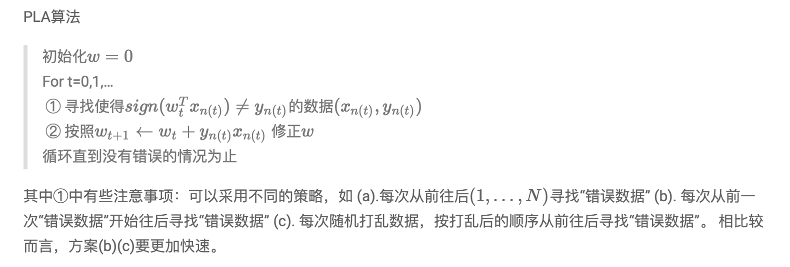

# Homeword 1

Q15-17



```python
import numpy as np


def perceptron(X, Y, theta, eta=1):
    t = 0
    while True:
        # 返回+1，-1，0
        inner = np.sign(X.dot(theta))
        inner[np.where(inner == 0)] = -1
        # 如果是二维平面，where返回两个array，前一个是x的值，后一个是y的值
        index = np.where(inner != Y)[0]
        if not index.any():
            break
        # permutation随机变化一个sequence的顺序
        pos = index[np.random.permutation(len(index))[0]]
        theta += eta * Y[pos, 0] * X[pos:pos + 1, :].T
        t += 1
    return theta, t


# Q15
data = np.loadtxt('hw1_15_train.dat.txt')
row, col = data.shape
X = np.c_[np.ones((row, 1)), data[:, :-1]]
Y = data[:, -1:]
theta = np.zeros((col, 1))
eta = 1
theta, t = perceptron(X, Y, theta, eta)
print(t)

# Q16
cnt = 0
for i in range(2000):
    theta = np.zeros((col, 1))
    eta = 1
    theta, t = perceptron(X, Y, theta, eta)
    cnt += t
print(cnt / 2000)

# Q17
cnt = 0
for i in range(2000):
    theta = np.zeros((col, 1))
    eta = 0.25
    theta, t = perceptron(X, Y, theta, eta)
    cnt += t
print(cnt / 2000)

"""
41
40.5195
40.7095
"""
```


