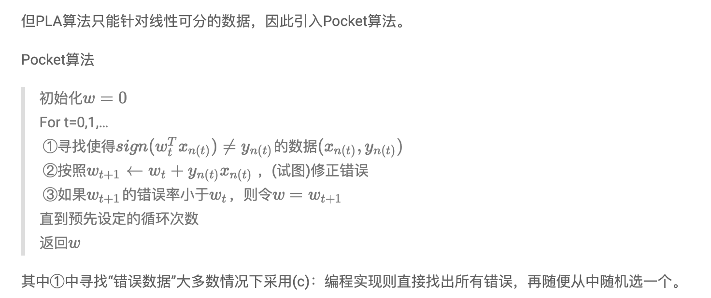

# Homework 1

Q15-17


```python
import numpy as np


def load_data(filename):
    data = np.loadtxt(filename)
    row, col = data.shape
    X = np.c_[np.ones((row, 1)), data[:, :-1]]
    Y = data[:, -1:]
    return X, Y


def perceptron(X, Y, theta, eta=1):
    t = 0
    while True:
        # 返回+1，-1，0
        inner = np.sign(X.dot(theta))
        inner[np.where(inner == 0)] = -1
        # 如果是二维平面，where返回两个array，前一个是x的值，后一个是y的值
        index = np.where(inner != Y)[0]
        if not index.any():
            break
        # permutation随机变化一个sequence的顺序
        pos = index[np.random.permutation(len(index))[0]]
        theta += eta * Y[pos, 0] * X[pos:pos + 1, :].T
        t += 1
    return theta, t


# Q15
X, Y = load_data('hw1_15_train.dat.txt')
row, col = X.shape
theta = np.zeros((col, 1))
eta = 1
theta, t = perceptron(X, Y, theta, eta)
print(t)

# Q16
cnt = 0
for i in range(2000):
    theta = np.zeros((col, 1))
    eta = 1
    theta, t = perceptron(X, Y, theta, eta)
    cnt += t
print(cnt / 2000)

# Q17
cnt = 0
for i in range(2000):
    theta = np.zeros((col, 1))
    eta = 0.25
    theta, t = perceptron(X, Y, theta, eta)
    cnt += t
print(cnt / 2000)

"""
41
40.5195
40.7095
"""
```

Q18-20



```python
import numpy as np


def load_data(filename):
    data = np.loadtxt(filename)
    row, col = data.shape
    X = np.c_[np.ones((row, 1)), data[:, :-1]]
    Y = data[:, -1:]
    return X, Y


def mistake(inner, Y):
    row, col = Y.shape
    return np.sum(inner != Y) / row


def pocket(X, Y, theta, t, eta=1):
    inner = np.sign(X.dot(theta))
    inner[np.where(inner == 0)] = -1
    error_old = mistake(inner, Y)
    thetabest = np.zeros(theta.shape)
    for i in range(t):
        index = np.where(inner != Y)[0]
        if not index.any:
            break
        pos = index[np.random.permutation(len(index))[0]]
        theta += eta * Y[pos, 0] * X[pos:pos + 1, :].T
        inner = np.sign(X.dot(theta))
        inner[np.where(inner == 0)] = -1
        error_now = mistake(inner, Y)
        if error_now < error_old:
            thetabest = theta.copy()
            error_old = error_now
    return thetabest, theta


# Q18
X, Y = load_data('hw1_18_train.dat.txt')
X_test, Y_test = load_data('hw1_18_test.dat.txt')
row, col = X.shape
theta = np.zeros((col, 1))
eta = 1
cnt = 0
for i in range(2000):
    theta = np.zeros((col, 1))
    theta, thetabad = pocket(X, Y, theta, 50, eta)
    inner = np.sign(X_test.dot(theta))
    inner[np.where(inner == 0)] = -1
    error = mistake(inner, Y_test)
    cnt += error
print(cnt / 2000)

# Q19
X, Y = load_data('hw1_18_train.dat.txt')
X_test, Y_test = load_data('hw1_18_test.dat.txt')
row, col = X.shape
theta = np.zeros((col, 1))
eta = 1
cnt = 0
for i in range(2000):
    theta = np.zeros((col, 1))
    theta, thetabad = pocket(X, Y, theta, 50, eta)
    inner = np.sign(X_test.dot(thetabad))
    inner[np.where(inner == 0)] = -1
    error = mistake(inner, Y_test)
    cnt += error
print(cnt / 2000)

# Q20
X, Y = load_data('hw1_18_train.dat.txt')
X_test, Y_test = load_data('hw1_18_test.dat.txt')
row, col = X.shape
theta = np.zeros((col, 1))
eta = 1
cnt = 0
for i in range(2000):
    theta = np.zeros((col, 1))
    theta, thetabad = pocket(X, Y, theta, 100, eta)
    inner = np.sign(X_test.dot(theta))
    inner[np.where(inner == 0)] = -1
    error = mistake(inner, Y_test)
    cnt += error
print(cnt / 2000)

"""
0.13207599999999978
0.35613699999999954
0.11539200000000041
"""
```

